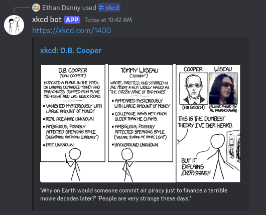
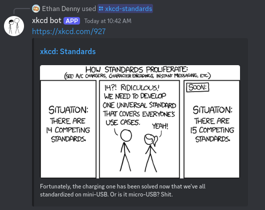

Sometimes project ideas come from unexpected places. Last Tuesday, I was part of a discussion about the new [uv](https://github.com/astral-sh/uv) Python packager that led to this message (remarking on the development of yet another solution for Python packaging):


My brain immediately thought "that should be a Discord bot" and this weekend I decided to built it.

### Getting started

Writing a Discord bot like this would require a lightweight language that had strong support for HTTP fetching and regular expressions. I don't like to use TypeScript outside of the browser, and I wasn't in the mood for Python, so I settled on Go. The standard library's `net/http` and
bwmarrin's [discordgo](github.com/bwmarrin/discordgo) promised an easy development experience, and I think they delivered pretty well.

The first step was grabbing this link at the bottom of all xkcd comics using regular expressions:


Internally, the HTML is straightforward and was easy to parse with a regular expression:

```html
<a href="https://imgs.xkcd.com/comics/time_traveler_causes_of_death.png">
  https://imgs.xkcd.com/comics/time_traveler_causes_of_death.png
</a>
```

Go's `regexp` library's `FindString` function was useful here, as it returns the first regex match for the string passed to it.

```go
// "getHTML" is a function that grabs the raw HTML of any URL
// "number" is a string that contains the ID of the desired comic
content := getHTML("https://xkcd.com/" + number)
re := regexp.MustCompile(`https://imgs.xkcd.com/comics/.*\.png`)
link := re.FindString(content)
```

So now I could grab an image of any xkcd comic. Awesome!

Or so I thought. Turns out that not all xkcd comics get served as PNGs - some are JPEGs. This baffled me for longer than I care to admit, but it was at least an easy fix.

```go
// Bad!
`https://imgs.xkcd.com/comics/.*\.png`

// Good!
`https://imgs.xkcd.com/comics/.*\.(png|jpg)`
```

### Building the real bot

After a little more work, I had two functions: `getComic(number)` would return the name and image link of the comic with the ID provided to it, and `getRandomComic()` simply grabbed [https://c.xkcd.com/random/comic/](https://c.xkcd.com/random/comic/) and then returned the name and link of the redirect.

`discordgo` is a powerful package that makes building a Discord bot really easy. Most of what I did with it was based on the [slash commands example](https://github.com/bwmarrin/discordgo/blob/master/examples/slash_commands/main.go), but I opted for a simpler implementation. For example, this snippet from the example (adapted for my purposes):

```go
options := i.ApplicationCommandData().Options

optionMap := make(map[string]*discordgo.ApplicationCommandInteractionDataOption, len(options))
for _, opt := range options {
	optionMap[opt.Name] = opt
}

if opt, ok := optionMap["integer-option"]; ok {
	id := opt.IntValue()
	// Do something with `id`
}
```

Got rewritten as:

```go
options := i.ApplicationCommandData().Options
id := options[0].IntValue()
// Do something with `id`
```

The TL;DR is that the example looked complicated but after stripping it down it was easy to grasp.

I also wrote a `getMaxComic()` function to return the id of the latest publication. That used a regex like the other methods, but just looked at the homepage, [https://xkcd.com/](https://xkcd.com/), and the permanent link under the comic, to get the result.

### Containerizing

I knew I wanted to use [Docker](https://www.docker.com/), but I wasn't familiar with how to get it set up. After much screwing around with my `Dockerfile`, I got the following:

```dockerfile
FROM golang:1.22.4
WORKDIR /app
COPY . .
RUN go mod download
RUN go build -o ./xkcd-bot
CMD [ "./xkcd-bot" ]
```

It seems really easy to me in hindsight, but getting file permissions working was extremely frustrating and led to me temporarily breaking `sudo` (terrifying). If you're also unfamiliar with Docker, don't make this mistake like I did:

```dockerfile
# Bad!
CMD [ "./foo --bar spam --egg" ]

# Good!
CMD [ "./foo",  "--bar", "spam", "--egg" ]
```

To avoid further headaches, I put the authentication token for my bot (previously passed as a command line argument) into a `.env` file which made it easy to store locally and not [accidentally commit to my GitHub repo](https://www.gitguardian.com/state-of-secrets-sprawl-report-2024).

Finally, I was able to see the fruits of my labour:


Oops.

At some point I changed the message structure to also include a link to the comic itself, and it turned out that simply linking the comic provided a lovely link preview, which I probably should have guessed. Easy fix, but a lot of wasted time.



I also included a slash command, `/xkcd-standards`, that links directly to [https://xkcd.com/927/](https://xkcd.com/927/), the infamous "How Standards Proliferate" comic and the motivating force of this entire project.



### Deploying

I didn't want to rely on local deployment, so it was time to look at hosting options. I considered DigitalOcean, but decided to go with [Fly.io](https://fly.io). I'd never used it before, but it promised 1. easy deployment and 2. no charges until my bill went over $5 a month (they say it would actually cost them more to charge such a small amount than they would earn, so for small projects, it's a fantastic options).

Fly promised I could "deploy my app in five minutes". Surely it couldn't be that easy though? I was pleasantly surprised to find it was. All I had to do was run a single `curl` command to install `flyctl`, and then run `fly launch` in the directory and I was almost 100% good to go. I just had to replace the `[[services]]` table with this:

```toml
[[services]]
internal_port = 3000
protocol = "tcp"

# Allow machines to run continuously
auto_start_machines = false
auto_stop_machines = false
```

After a little tinkering to make sure everything was solid, and a little proactive bug fixing, the bot was deployed and ready to go!

### Conclusion

This was a really fun bite-sized project, and I feel much more confident with Go and Docker and will definitely be using
Fly.io for my deployments in the future. I recommend anyone who wants to learn about these technologies to use `discordgo`; it's just a joyful experience.

If you want to check out the repo, you can find that [here](https://github.com/EthanDenny/xkcd-bot), and if you want to add `xkcd bot` to your own server, you can use [this link](https://discord.com/oauth2/authorize?client_id=1276667730409558037&permissions=277025409024&integration_type=0&scope=applications.commands+bot)!
