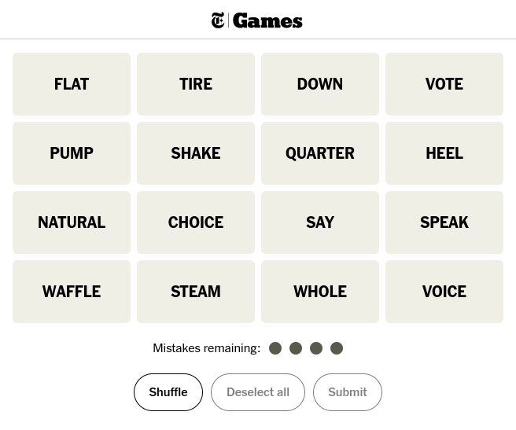

I've always been a big fan of the New York Times word games. Their most famous offering is undoubtedly Wordle, but their other puzzles are also extremely creative. A current favourite is [Connections](https://www.nytimes.com/games/connections):

The premise of Connections is simple: given 16 words, select groups of four tiles at a time which "connect" in some way. Categories range from simple ([simple example of a connection]) to the downright diabloical ([example of a complicated connection]). It's so notorious for its obscure groupings that its become a bit of a joke online that the "Connections writers" are a wacky bunch hell-bent on confusing word game fans.

Connections' more popular cousin, Wordle, has a fairly well-defined problem space. Its the word list and order of answers are known, and the required information to solve the puzzle is presented to the player. Connections, on the other hand, relies more on nuance than linguistic probabilities. How could I extract these underlying similarities, and connect groups which ultimately solve the puzzle?

## Initial Approach

[Word2Vec](https://en.wikipedia.org/wiki/Word2vec) is a decade-old form of NLP that models words as many-dimensional vectors. It's definitely nowhere near state-of-the-art, but it's got nice library support and provided me with a useful measurement, the distance between vectors as an approximation of the similarity between words, that I could exploit to get something up and running quickly. My language of choice, at least initially, was Go. There wasn't any reason I went with Go in particular, I just wanted more experience with it and wondered how well it might be able to solve the problem. Spoiler: not well.

First, I needed a library that could interface with a Word2Vec model. Search.io's [Word2Vec Go wrapper](https://github.com/sajari/word2vec) seemed like a strong choice, with a lot of stars and the last commit in 2022. Not the most active repo, but Word2Vec has been largely overtaken by large language models (LLMs), so I wasn't surprised it hadn't had a lot of attention recently.

Next, I had to find a Word2Vec model that I could use, as I didn't want to train my own until I had evaluated if Word2Vec was a worthwhile strategy. I opted for the [Google News 300-dimension](https://drive.google.com/file/d/0B7XkCwpI5KDYNlNUTTlSS21pQmM/) model, as it seemed like a good starting point based on the tutorials I read. This model was trained on a Google News corpus and contained three million word vectors, more than enough to get me started.

Unfortunately, the problems with a Go implementation soon became apparent.
